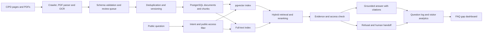

# RAG Based Chatbot for CiPD

An individual project for the Centre for Intelligent Product Development (CiPD), IIIT Delhi. The chatbot answers questions about CiPD and the iPD-CP programme using the centre's published content, with source citations and freshness checks.

## Product goal

Build a reliable website assistant that helps prospective applicants, students, founders, mentors, industry partners, and visitors find current CiPD information without searching across pages and brochures.

Every factual answer should:

- be grounded in retrieved CiPD content;
- link to the exact source page or document;
- show when the source was last indexed;
- distinguish current details from archived cohort information;
- decline to guess when the sources do not support an answer.

## Core system modules

These three modules are the starting requirements for the project.

### 1. Content database

Use PostgreSQL with pgvector as the shared knowledge and product database. It should store:

- source documents and version history;
- paragraph or section chunks with embeddings;
- extracted metadata and ingestion status;
- anonymous visitor events;
- user question logs and retrieval traces;
- staff-reviewed answer and FAQ drafts.

Every document and derived chunk must carry a visibility label: `public`, `internal`, or `confidential`. The public website assistant may retrieve only `public` rows. Authenticated staff tools may use approved `internal` content. `confidential` content must be excluded from normal chatbot retrieval and accessible only to specifically authorised administrators. Enforce this boundary in database queries and PostgreSQL row-level security rather than relying only on the prompt.

### 2. Ingestion pipeline

The pipeline reads approved web pages and PDFs, detects section boundaries, creates one embedding per meaningful chunk, and stores the source relationship for citations. It automatically extracts fields such as title, authors, publication year, page number, section heading, cohort, document type, and canonical URL.

Extracted metadata must be checked against a fixed schema. Missing, malformed, contradictory, or low-confidence fields go to a review queue instead of being silently stored. Scanned PDFs should use OCR, while tables, deadlines, fees, and other structured facts should be preserved as structured records as well as searchable text.

### 3. “Ask CiPD” assistant

Embed a public chat widget on the CiPD website. It answers only from retrieved `public` paragraphs, places citations beside supported claims, and shows the source title and last indexed date. If evidence is missing or conflicting, it should say that it cannot verify the answer and offer the official contact or enquiry form. It must never search `internal` or `confidential` content for a public visitor.

The first version should support programme, project, faculty, event, application, partnership, and contact questions. It should retain short session context while treating each factual statement as a new retrieval task.

## Additional product ideas

Keep the additional scope limited to these four features:

1. **FAQ gap and visitor-question analytics:** group anonymous questions by topic and audience, measure which questions were answered or handed off, and show which information visitors cannot easily find. The professor or authorised team can use this evidence to improve FAQs and website copy.
2. **Structured storage for important facts:** store deadlines, fees, grants, eligibility rules, and official contacts as validated records linked to their source paragraphs. This gives time-sensitive answers an additional accuracy check.
3. **Role-aware internal staff search:** provide an authenticated search experience for IIIT Delhi faculty and authorised staff. Public visitors continue to search only public content; internal material is filtered through database access rules.
4. **Project, faculty, mentor, technology, and event discovery:** connect the centre's people, work, expertise, and activities through shared metadata so users can search across them from one place.

## Audience-aware user experience

CiPD serves people from IIIT Delhi and visitors from outside the college. The interface should make both groups comfortable without asking them to understand the site's structure first.

### IIIT Delhi students, faculty, and staff

- Offer starting prompts such as “Find a faculty member by expertise,” “Show projects using sensors,” “Which mentor works in embedded systems?” and “What events are coming up?”
- Let signed-in authorised users switch to internal staff search, with the active access level always visible.
- Connect faculty, mentors, projects, technologies, and events so a student can move from an interest to relevant people and active work.
- Keep internal results visually distinct and never place them in a public answer.

### Applicants and visitors from outside IIIT Delhi

- Explain abbreviations such as CiPD and iPD-CP the first time they appear.
- Put common public questions first: programme overview, eligibility, fees, grants, deadlines, application steps, projects, and official contacts.
- Use plain language and give the direct answer before supporting detail.
- Show a visible source link and “last checked” date for important facts.
- When an answer is unavailable, provide the appropriate official contact route instead of a generic error.

### Shared interaction design

- Start with audience choices such as **IIIT Delhi member**, **prospective applicant**, and **industry or mentor**; use the choice only to prioritise suggestions, not to change facts.
- Provide search suggestions and filter chips for projects, people, technologies, and events.
- Keep answers short by default, with expandable sources and detail.
- Preserve the user's current topic during follow-up questions while re-checking every factual claim against the knowledge base.
- Design for mobile screens, keyboard navigation, readable contrast, and clear loading and error states.

## Questions the chatbot should answer

### CiPD and iPD-CP

- What is CiPD and what does it build?
- What is the 24-week iPD-CP programme?
- Who is eligible: final-year students, recent graduates, founders, or working professionals?
- What is taught in design thinking, embedded hardware, firmware, IoT, PCB design, testing, and production readiness?
- What are the current cohort dates, application windows, fees, scholarships, fellowships, grants, and incubation options?
- How can someone apply, submit an idea, become a mentor, host an event, or partner with CiPD?

### Projects

- Search the project portfolio by category, technology, feature, or team member.
- Summarise a project's problem, solution, key features, student team, maturity, and source.
- Compare projects such as SphygSense, ChillPod, Beyond Sight System, Harvesink, SoleSync, TriSURE, Smart Scale, CattleWatch, DigiScope, and IVFlow.
- Recommend related projects for interests such as Health Tech, Sensors, Embedded Systems, Agri Tech, IoT, Sustainability, or Smart Tech.

### People and activities

- Find CiPD faculty and guest faculty by expertise, institution, or topic.
- Answer questions about workshops, seminars, industry visits, hackathons, and upcoming events.
- Find relevant blogs, lectures, and programme resources.
- Give the official contact details and IIIT Delhi location.

## Current source scope

| Source | Content |
|---|---|
| `https://cipd.iiitd.ac.in/` | Centre overview, featured projects, events, seminars, FAQ, contact details |
| `https://cipd.iiitd.ac.in/ipd-cp` | Programme structure, curriculum, eligibility, financial support, grants, cohort dates, application link |
| `https://cipd.iiitd.ac.in/projects` and project pages | Project categories, summaries, features, teams, images |
| `https://cipd.iiitd.ac.in/faculty` | Faculty, guest faculty, roles, expertise, profile links |
| `https://cipd.iiitd.ac.in/events` | Event dates, types, descriptions, registration details |
| `https://cipd.iiitd.ac.in/blogs` | Articles and lab notes |
| `https://cipd.iiitd.ac.in/connect` | Partnership, mentoring, hosting, and contact routes |
| `https://cipd.iiitd.ac.in/ideas` | Idea submission guidance |
| Official CiPD PDF brochures | Detailed programme and cohort information |

The crawler must stay within approved CiPD and IIIT Delhi domains. External links should be stored only as references, not crawled automatically.

## Recommended architecture

### Suggested stack

- **Backend:** Python, FastAPI, Pydantic
- **Ingestion:** Trafilatura or Beautiful Soup for HTML; PyMuPDF for PDF files
- **Embeddings:** OpenAI `text-embedding-3-small` for a first version, with `text-embedding-3-large` as an accuracy upgrade
- **Vector store:** PostgreSQL with pgvector for production; Chroma for a local prototype
- **Keyword retrieval:** PostgreSQL full-text search or BM25
- **Reranking:** cross-encoder reranker after hybrid retrieval
- **Generation:** an instruction-following model with structured citations
- **Frontend:** Next.js/React widget that can be embedded on the CiPD website
- **Deployment:** Docker, CI checks, managed PostgreSQL, scheduled ingestion job

PostgreSQL is the preferred production store because vector search, full-text search, metadata, visitor events, question logs, drafts, and access policies can share one transactional system. pgvector supports exact search and HNSW or IVFFlat approximate indexes; combine vector results with PostgreSQL full-text results using reciprocal rank fusion or a reranker.

## Proposed database model

| Table | Purpose | Important fields |
|---|---|---|
| `documents` | One logical source | `id`, `canonical_url`, `title`, `authors`, `year`, `document_type`, `visibility`, `status` |
| `document_versions` | Immutable snapshots for freshness and comparison | `document_id`, `content_hash`, `published_at`, `indexed_at`, `supersedes_id` |
| `chunks` | Searchable paragraph or section units | `version_id`, `heading_path`, `page_number`, `text`, `embedding`, `token_count`, `visibility` |
| `structured_facts` | Dates, fees, grants, eligibility, contacts, and other sensitive-to-change facts | `subject`, `predicate`, `value`, `valid_from`, `valid_until`, `source_chunk_id` |
| `ingestion_jobs` | Crawl and validation audit trail | `source`, `started_at`, `completed_at`, `status`, `error`, `review_required` |
| `visitor_events` | Privacy-safe product analytics | `session_id`, `event_type`, `page`, `occurred_at`, `metadata` |
| `question_logs` | Questions, retrieval results, answer outcome, and feedback | `session_id`, `question`, `intent`, `answer_status`, `citations`, `latency_ms` |
| `answer_drafts` | Human-reviewed proposed answers or FAQ entries | `question_cluster`, `draft`, `evidence_ids`, `review_status`, `reviewed_by` |

Use content hashes and unique constraints to prevent duplicate documents and chunks. Keep raw visitor identifiers out of analytics where possible, and define retention periods for question logs and events.

## Ingestion and indexing specification

1. Crawl approved routes and discover project, event, blog, profile, and brochure sources.
2. Parse HTML and PDFs; run OCR only when a page has no reliable text layer.
3. Detect document and section boundaries before chunking so headings remain attached to their paragraphs.
4. Extract title, authors, year, headings, paragraphs, lists, tables, links, dates, page numbers, and document version.
5. Validate extracted metadata with a fixed Pydantic or JSON Schema model. Quarantine invalid or low-confidence results for review.
6. Assign `public`, `internal`, or `confidential` visibility at document level and copy the effective label to every derived chunk.
7. Remove navigation, repeated footer content, duplicated profiles, and duplicate project records.
8. Canonicalise URLs and compute document and chunk hashes to prevent duplicate storage.
9. Split by semantic section, aiming for 400-700 tokens with 10-15% overlap, while keeping tables and short policy sections intact.
10. Attach metadata: `source_url`, `page_type`, `title`, `authors`, `year`, `section`, `page_number`, `category`, `person`, `project`, `event_date`, `cohort`, `visibility`, `published_at`, `indexed_at`, and `content_hash`.
11. Store structured, time-sensitive facts separately and link each fact back to the source chunk that supports it.
12. Keep previous versions so current answers cannot accidentally mix old and new cohort details.
13. Re-index on a schedule and support an admin-triggered refresh after CMS updates.

## Retrieval and answer rules

- Use hybrid retrieval: semantic similarity plus keyword/BM25 matching.
- Apply metadata filters for page type, project category, person, event date, and cohort.
- Apply the access filter before vector or keyword retrieval; the public assistant always requires `visibility = 'public'`.
- Rerank the best candidates and send only the strongest evidence to the language model.
- Prefer the newest official source when multiple versions disagree.
- For deadlines, fees, and funding, require two checks: the most recent cohort metadata and the source's visible date.
- Put inline citations after the sentence they support.
- Include a clear fallback such as: “I could not verify that from the current CiPD sources.”
- Never invent admissions decisions, funding eligibility, availability, or contact details.
- Log whether the request was answered, refused, or handed off; do not store passwords, form submissions, or unnecessary personal data.

## High-value features

- **Ask CiPD:** public answers grounded in retrieved public paragraphs, with citations and official-contact handoff when evidence is absent.
- **Verified important facts:** deadlines, fees, grants, eligibility, and contacts are checked against structured records linked to their sources.
- **Discovery search:** finds and connects projects, faculty, mentors, technologies, and events.
- **FAQ gap analytics:** shows what college members and outside visitors ask, which topics are missing, and where handoffs occur.
- **Internal staff search:** gives authenticated, authorised IIIT Delhi users a clearly labelled search experience for approved internal material.

## Safety and privacy

- Do not index unpublished CMS content, passwords, application submissions, private emails, or personal contact data.
- Enforce document visibility through PostgreSQL roles and row-level security with default-deny policies for protected rows.
- Redact secrets and personal data from logs.
- Treat user prompts and retrieved pages as untrusted input; retrieved text cannot override system rules.
- Rate-limit public endpoints and protect admin refresh actions.
- Store anonymous analytics by default and document the retention period.

## Evaluation

Create a reviewed test set covering:

- programme facts, eligibility, curriculum, fees, scholarships, fellowships, grants, and deadlines;
- every project and category;
- faculty and guest faculty;
- events, seminars, contact information, and application routes;
- ambiguous, outdated, adversarial, and unanswerable questions.

Track:

- retrieval recall at K;
- answer faithfulness;
- citation correctness and coverage;
- freshness accuracy for dates and fees;
- refusal quality on unsupported questions;
- median and 95th-percentile response time;
- user feedback and successful human handoffs.

## Delivery plan

### Phase 1: working prototype

- Crawl the public CiPD website and brochures.
- Build the PostgreSQL/pgvector content database with document visibility labels.
- Build schema-validated ingestion with a quarantine queue for bad extractions.
- Build clean, deduplicated section chunks with citation metadata.
- Add hybrid retrieval and cited answers.
- Add refusal and official-contact handoff when evidence is absent.
- Provide a simple “Ask CiPD” chat page, question logging, and an evaluation script.

### Phase 2: website-ready assistant

- Add audience-aware starting prompts, discovery filters, session context, and a responsive embeddable widget.
- Add structured records for deadlines, fees, grants, eligibility, and official contacts.
- Add privacy-safe question analytics and the FAQ gap dashboard.
- Add monitoring and rate limits.

### Phase 3: advanced experience

- Add role-aware internal staff search with PostgreSQL access policies.
- Improve cross-search and relationships among projects, faculty, mentors, technologies, and events.

## Reference implementation guidance

- [OpenAI retrieval guide](https://developers.openai.com/api/docs/guides/retrieval) for semantic search, attributes, ranking, and grounded response patterns.
- [OpenAI evals guide](https://developers.openai.com/api/docs/guides/evals) for repeatable quality evaluation.
- [pgvector documentation](https://github.com/pgvector/pgvector) for exact and approximate vector search, metadata filtering, and hybrid search with PostgreSQL full-text search.
- [PostgreSQL row security documentation](https://www.postgresql.org/docs/current/ddl-rowsecurity.html) for enforcing public, internal, and confidential access policies.

## Initial success criteria

- At least 90% citation correctness on the reviewed test set.
- No unsupported current deadline, fee, funding, or eligibility claims.
- No duplicate project or faculty records in the index.
- Most common questions answered in under five seconds in the deployed environment.
- Every answer includes a source or explicitly states that it could not be verified.
