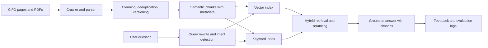

# RAG Based Chatbot for CiPD

An individual project for the Centre for Intelligent Product Development (CiPD), IIIT Delhi. The chatbot answers questions about CiPD and the iPD-CP programme using the centre's published content, with source citations and freshness checks.

## Product goal

Build a reliable website assistant that helps prospective applicants, students, founders, mentors, industry partners, and visitors find current CiPD information without searching across pages and brochures.

Every factual answer should:

- be grounded in retrieved CiPD content;
- link to the exact source page or document;
- show when the source was last indexed;
- distinguish current details from archived cohort information;
- decline to guess when the sources do not support an answer.

## Questions the chatbot should answer

### CiPD and iPD-CP

- What is CiPD and what does it build?
- What is the 24-week iPD-CP programme?
- Who is eligible: final-year students, recent graduates, founders, or working professionals?
- What is taught in design thinking, embedded hardware, firmware, IoT, PCB design, testing, and production readiness?
- What are the current cohort dates, application windows, fees, scholarships, fellowships, grants, and incubation options?
- How can someone apply, submit an idea, become a mentor, host an event, or partner with CiPD?

### Projects

- Search the project portfolio by category, technology, feature, or team member.
- Summarise a project's problem, solution, key features, student team, maturity, and source.
- Compare projects such as SphygSense, ChillPod, Beyond Sight System, Harvesink, SoleSync, TriSURE, Smart Scale, CattleWatch, DigiScope, and IVFlow.
- Recommend related projects for interests such as Health Tech, Sensors, Embedded Systems, Agri Tech, IoT, Sustainability, or Smart Tech.

### People and activities

- Find CiPD faculty and guest faculty by expertise, institution, or topic.
- Answer questions about workshops, seminars, industry visits, hackathons, and upcoming events.
- Find relevant blogs, lectures, and programme resources.
- Give the official contact details and IIIT Delhi location.

## Current source scope

| Source | Content |
|---|---|
| `https://cipd.iiitd.ac.in/` | Centre overview, featured projects, events, seminars, FAQ, contact details |
| `https://cipd.iiitd.ac.in/ipd-cp` | Programme structure, curriculum, eligibility, financial support, grants, cohort dates, application link |
| `https://cipd.iiitd.ac.in/projects` and project pages | Project categories, summaries, features, teams, images |
| `https://cipd.iiitd.ac.in/faculty` | Faculty, guest faculty, roles, expertise, profile links |
| `https://cipd.iiitd.ac.in/events` | Event dates, types, descriptions, registration details |
| `https://cipd.iiitd.ac.in/blogs` | Articles and lab notes |
| `https://cipd.iiitd.ac.in/connect` | Partnership, mentoring, hosting, and contact routes |
| `https://cipd.iiitd.ac.in/ideas` | Idea submission guidance |
| Official CiPD PDF brochures | Detailed programme and cohort information |

The crawler must stay within approved CiPD and IIIT Delhi domains. External links should be stored only as references, not crawled automatically.

## Recommended architecture

### Suggested stack

- **Backend:** Python, FastAPI, Pydantic
- **Ingestion:** Trafilatura or Beautiful Soup for HTML; PyMuPDF for PDF files
- **Embeddings:** OpenAI `text-embedding-3-small` for a first version, with `text-embedding-3-large` as an accuracy upgrade
- **Vector store:** PostgreSQL with pgvector for production; Chroma for a local prototype
- **Keyword retrieval:** PostgreSQL full-text search or BM25
- **Reranking:** cross-encoder reranker after hybrid retrieval
- **Generation:** an instruction-following model with structured citations
- **Frontend:** Next.js/React widget that can be embedded on the CiPD website
- **Deployment:** Docker, CI checks, managed PostgreSQL, scheduled ingestion job

## Ingestion and indexing specification

1. Crawl the approved routes and discover project, event, blog, and profile detail pages.
2. Extract page title, headings, paragraphs, lists, tables, links, dates, and document version.
3. Remove navigation, repeated footer content, duplicated profiles, and duplicate project records.
4. Canonicalise URLs and compute a content hash to prevent duplicate chunks.
5. Split by semantic section, aiming for 400-700 tokens with 10-15% overlap.
6. Attach metadata: `source_url`, `page_type`, `title`, `section`, `category`, `person`, `project`, `event_date`, `cohort`, `published_at`, `indexed_at`, and `content_hash`.
7. Keep previous versions of time-sensitive pages so a current answer cannot accidentally mix old and new cohort details.
8. Re-index on a schedule and support an admin-triggered refresh after CMS updates.

## Retrieval and answer rules

- Use hybrid retrieval: semantic similarity plus keyword/BM25 matching.
- Apply metadata filters for page type, project category, person, event date, and cohort.
- Rerank the best candidates and send only the strongest evidence to the language model.
- Prefer the newest official source when multiple versions disagree.
- For deadlines, fees, and funding, require two checks: the most recent cohort metadata and the source's visible date.
- Put inline citations after the sentence they support.
- Include a clear fallback such as: “I could not verify that from the current CiPD sources.”
- Never invent admissions decisions, funding eligibility, availability, or contact details.

## High-value features

- **Guided programme finder:** asks a few questions and explains whether the programme appears relevant, while directing the user to the official application page.
- **Project explorer:** filters and compares projects by domain, technology, team, and problem area.
- **Faculty and mentor matcher:** suggests relevant people from published expertise without exposing private data.
- **Deadline and freshness guard:** highlights stale or conflicting dates before an answer is shown.
- **Application checklist:** creates a personalised list of official steps and required links.
- **Event finder:** lists future events and can generate calendar-ready details.
- **Source preview:** expands the exact paragraph used for each answer.
- **Multilingual mode:** English and Hindi answers while citations remain tied to the original source.
- **Accessible interface:** keyboard navigation, screen-reader labels, adjustable text size, and optional voice input.
- **Human handoff:** routes unanswered partnership, admissions, or project enquiries to the official contact channel.
- **Admin dashboard:** crawl status, stale pages, unanswered questions, feedback, citation failures, and popular topics.

## Safety and privacy

- Do not index unpublished CMS content, passwords, application submissions, private emails, or personal contact data.
- Redact secrets and personal data from logs.
- Treat user prompts and retrieved pages as untrusted input; retrieved text cannot override system rules.
- Rate-limit public endpoints and protect admin refresh actions.
- Store anonymous analytics by default and document the retention period.

## Evaluation

Create a reviewed test set covering:

- programme facts, eligibility, curriculum, fees, scholarships, fellowships, grants, and deadlines;
- every project and category;
- faculty and guest faculty;
- events, seminars, contact information, and application routes;
- ambiguous, outdated, adversarial, and unanswerable questions.

Track:

- retrieval recall at K;
- answer faithfulness;
- citation correctness and coverage;
- freshness accuracy for dates and fees;
- refusal quality on unsupported questions;
- median and 95th-percentile response time;
- user feedback and successful human handoffs.

## Delivery plan

### Phase 1: working prototype

- Crawl the public CiPD website and brochures.
- Build clean, deduplicated chunks.
- Add hybrid retrieval and cited answers.
- Provide a simple chat page and an evaluation script.

### Phase 2: website-ready assistant

- Add filters, project explorer, session memory, feedback, and a responsive embeddable widget.
- Add scheduled refreshes and stale-content alerts.
- Add monitoring, rate limits, and privacy-safe analytics.

### Phase 3: advanced experience

- Add Hindi, voice input, event recommendations, application checklists, and faculty/project matching.
- Add an admin review queue for unanswered or conflicting questions.

## Initial success criteria

- At least 90% citation correctness on the reviewed test set.
- No unsupported current deadline, fee, funding, or eligibility claims.
- No duplicate project or faculty records in the index.
- Most common questions answered in under five seconds in the deployed environment.
- Every answer includes a source or explicitly states that it could not be verified.

